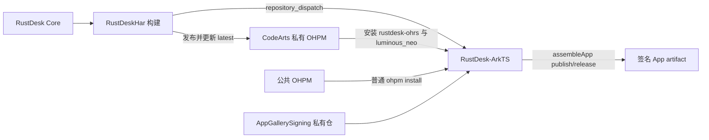

# RustDesk HAR → ArkTS GitHub Actions 链路

这套链路只负责 HarmonyOS 主控客户端的 Core HAR 与签名 App 构建，不包含 2in1 被控端、录屏或本地输入注入能力。



## ArkTS 构建流程

ArkTS workflow 只接受 `rustdesk-har-published` dispatch，并保留手动恢复入口。dispatch 只需要携带包名，不携带版本：

```json
{
  "package_name": "rustdesk-ohrs"
}
```

构建步骤固定为：

1. Checkout ArkTS，安装 Java 17 与 HarmonyOS 命令行工具。
2. 从 CodeArts 私仓安装 `rustdesk-ohrs@latest` 与 `luminous_neo@1.0.0`。
3. 删除私仓认证，再在根目录与 `entry` 执行普通 `ohpm install`。
4. Checkout 私有签名仓并调用 `.github/scripts/prepare-signing-config.sh` 准备签名配置。
5. 执行 App 级构建：

   ```shell
   hvigorw assembleApp -p product=publish -p buildMode=release
   ```

6. 找到并上传签名 `.app` artifact。

## GitHub 配置

workflow 使用 `harmonyos-ci-signing` Environment。

| 类型 | 名称 | 用途 |
|---|---|---|
| Secret | `CODEARTS_PRIVATE_OHPM` | CodeArts 私仓只读认证配置 |
| Secret | `SIGNING_REPOSITORY_TOKEN` | 读取签名私仓 |
| Variable | `SIGNING_REPOSITORY` | 可选，默认 `FrankHan052176/AppGallerySigning` |
| Variable | `SIGNING_REPOSITORY_REF` | 可选，默认固定到已验证的签名提交 |

`CODEARTS_PRIVATE_OHPM` 保存私仓认证片段，例如：

```ini
//devrepo.devcloud.cn-north-4.huaweicloud.com/artgalaxy/api/ohpm/cn-north-4_c07b1b38744f424b8d87a86532d38003_ohpm_1/:_read_auth=REPLACE_WITH_READ_ONLY_TOKEN
strict_ssl=true
```

不要把真实 Token 或 `.ohpmrc` 提交到仓库。

## AGC 占位

签名 App artifact 上传完成后保留两个禁用步骤：AGC 签名 App 上传与 AGC 测试发布。它们目前不执行任何外部写入，后续接入 AGC 凭据和 API 后再启用。
