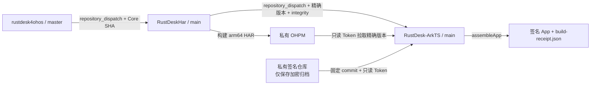

# RustDesk Core → HAR → ArkTS GitHub Actions 链路

这套链路只负责 HarmonyOS 主控客户端的内核 HAR 与 App 构建，不包含 2in1 被控端、录屏或本地输入注入能力。



## 设计约束

- 跨仓触发使用 `repository_dispatch`。`GITHUB_TOKEN` 不能直接驱动另一个仓库，因此 Core 和 HAR 各自使用一个只允许访问目标仓库的 fine-grained token。
- HAR 版本不是 `latest`。每次构建生成形如 `0.1.0-ci.<run>.<attempt>.g<core-sha>` 的唯一版本，ArkTS 只安装事件中携带的精确版本。
- HAR 内嵌 `BUILD_PROVENANCE.json`，包含 Core commit、HAR 源码 commit 和 Action 地址。
- 发布端计算 HAR 的 SHA-256 与 OHPM `sha512-...` integrity。ArkTS 安装后必须用 lockfile 核对包名、精确版本与 integrity，再核对包内 provenance。
- `core-latest` 只作为人工查询指针，自动构建不依赖它。
- 自动链路默认执行 `assembleApp product=default buildMode=debug`。可通过 ArkTS 仓库变量改成 `publish/release`，手动运行也可选择；`publish` 在这里仍然只代表 App 级 `assembleApp` 产品。

## 默认分支合入顺序

`repository_dispatch` 只会运行目标仓库默认分支上已经存在的 workflow，首次启用必须按以下顺序：

1. 先将 ArkTS 的 `.github/workflows/build-private-har.yml` 合入 `main`，配置私有 OHPM 与签名环境。
2. 再将 HAR 的 `.github/workflows/publish-private-ohpm.yml` 合入 `main`，完成一次手动发布并确认 ArkTS 被唤醒。
3. 最后将 Core 的 `.github/workflows/dispatch-harmonyos-har.yml` 合入 `master`，开启每次 Core 主分支提交的自动链路。

## GitHub 配置矩阵

### `FrankHan052176/rustdesk4ohos`

| 类型 | 名称 | 最小权限/值 |
|---|---|---|
| Secret | `HAR_DISPATCH_TOKEN` | fine-grained token；仅 `FrankHan052176/RustDeskHar`，`Contents: Read and write` |
| Variable | `HAR_REPOSITORY` | 可选，默认 `FrankHan052176/RustDeskHar` |

### `FrankHan052176/RustDeskHar`

建议创建 Environment：`ohpm-publish`，并限制为 `main`。

| 类型 | 名称 | 最小权限/值 |
|---|---|---|
| Environment Secret | `OHPM_PUBLISH_CONFIG` | 完整的发布端 `.ohpmrc`；使用私仓读写 AccessToken |
| Environment Secret | `ARKTS_DISPATCH_TOKEN` | fine-grained token；仅 `FrankHan052176/RustDesk-ArkTS`，`Contents: Read and write` |
| Variable | `CORE_REPOSITORY` | 可选，默认 `FrankHan052176/rustdesk4ohos` |
| Variable | `ARKTS_REPOSITORY` | 可选，默认 `FrankHan052176/RustDesk-ArkTS` |

### `FrankHan052176/RustDesk-ArkTS`

建议创建 Environment：`harmonyos-ci-signing`，限制为 `main`；若启用 `publish/release`，再考虑 required reviewers。

| 类型 | 名称 | 最小权限/值 |
|---|---|---|
| Environment Secret | `OHPM_READ_CONFIG` | 完整的消费端 `.ohpmrc`；只读 AccessToken |
| Environment Secret | `SIGNING_REPO_TOKEN` | fine-grained token；只对签名私仓开放 `Contents: Read` |
| Environment Secret | `SIGNING_BUNDLE_PASSWORD` | 加密签名归档的独立高强度密码 |
| Variable | `SIGNING_REPOSITORY` | 私有签名仓库，例如 `FrankHan052176/HarmonyOS-Signing` |
| Variable | `SIGNING_REPOSITORY_REF` | 签名仓库的完整 40 位 commit SHA，不使用可移动分支或 tag |
| Variable | `SIGNING_BUNDLE_PATH` | 可选，默认 `rustdesk/signing-bundle.tar.gz.enc` |
| Variable | `LUMINOUS_NEO_PACKAGE` | 可选，默认 `luminous_neo` |
| Variable | `LUMINOUS_NEO_VERSION` | 必填；私有 OHPM 中的精确版本 |
| Variable | `HAR_REPOSITORY` | 可选，默认 `FrankHan052176/RustDeskHar` |
| Variable | `ARKTS_CI_PRODUCT` | 可选，自动链路默认 `default`，也可设为 `publish` |
| Variable | `ARKTS_CI_BUILD_MODE` | 可选，自动链路默认 `debug`，也可设为 `release` |

说明：fine-grained token 调用 `POST /repos/{owner}/{repo}/dispatches` 时，目标仓库需要 `Contents: Read and write`。不要复用 OHPM Token、签名仓 Token或两个 dispatch Token。

## OHPM Secret 内容

`OHPM_PUBLISH_CONFIG` 示例：

```ini
registry=https://ohpm-private.example.com/repos/ohpm/,https://ohpm.openharmony.cn/ohpm/
publish_registry=https://ohpm-private.example.com/repos/ohpm/
//ohpm-private.example.com/repos/ohpm/:_auth=REPLACE_WITH_READ_WRITE_TOKEN
strict_ssl=true
lockfile_stable_order=true
```

`OHPM_READ_CONFIG` 示例：

```ini
registry=https://ohpm-private.example.com/repos/ohpm/,https://ohpm.openharmony.cn/ohpm/
//ohpm-private.example.com/repos/ohpm/:_read_auth=REPLACE_WITH_READ_ONLY_TOKEN
strict_ssl=true
lockfile_stable_order=true
```

AccessToken 左侧的仓库地址必须去掉 `https:`，并保留仓库路径末尾的 `/`。私仓应排在公共仓之前，公共仓作为 `@ohos/hypium` 等依赖的后备源。不要把真实 `.ohpmrc` 写入仓库；两个工程都已忽略根目录 `.ohpmrc`。

ArkTS Action 同时从私仓安装 `rustdesk-ohrs` 与 `luminous_neo`。因此启用链路前，必须先将当前 Luminous Neo HAR 发布到同一私仓，并把其精确版本写入 `LUMINOUS_NEO_VERSION`；源码中的本地文件依赖只保留给本机开发，CI 会在临时 checkout 中改写。

## 私有签名仓库

私有仓库中不提交裸 `.p12` 或可直接使用的密码，只提交加密归档：

```text
HarmonyOS-Signing (private)
└── rustdesk/
    └── signing-bundle.tar.gz.enc
```

归档解密后的固定结构：

```text
signingConfigs.json
materials/
├── debug.cer
├── debug.p7b
├── publish.cer
├── publish.p7b
└── signing.p12
```

`signingConfigs.json` 只保存原 `app.signingConfigs` 数组，不包含 `app`、`products`、`buildModeSet` 或 `modules`。数组必须同时包含名为 `default` 与 `publish` 的配置。所有签名文件路径使用 `__SIGNING_ROOT__` 占位，例如：

```json5
"storeFile": "__SIGNING_ROOT__/materials/signing.p12",
"profile": "__SIGNING_ROOT__/materials/publish.p7b",
"certpath": "__SIGNING_ROOT__/materials/publish.cer"
```

`storePassword`、`keyPassword` 和 `keyAlias` 也只存在于这个加密归档内部。归档命令必须与 Action 的解密参数一致：

```bash
signing_stage="$(mktemp -d)"
signing_archive="$(mktemp)"

# 将 signingConfigs.json 与 materials/ 放入 $signing_stage 后执行：
tar -C "$signing_stage" -czf "$signing_archive" .
openssl enc -aes-256-cbc -salt -pbkdf2 -iter 200000 \
  -in "$signing_archive" \
  -out rustdesk/signing-bundle.tar.gz.enc
```

公开仓库中的 `build-profile.json5` 不包含 `signingConfigs`，product 也不包含 `signingConfig`。Action 解密归档后只把临时目录写入 `RUSTDESK_SIGNING_DIR`；`hvigorfile.ts` 在配置阶段读取并校验 `signingConfigs.json`，再将签名配置注入内存中的构建模型，不覆盖或生成受 Git 跟踪的 `build-profile.json5`。

加密时输入的密码保存为 ArkTS Environment Secret `SIGNING_BUNDLE_PASSWORD`。提交加密文件后，将该提交的完整 SHA 配置到 `SIGNING_REPOSITORY_REF`。Action 只把归档解密到 runner 临时目录，构建结束删除解密目录与 OHPM 配置。

## 首次启用与恢复

1. 在 HAR 仓库手动运行 `Publish RustDesk HAR to private OHPM`，`core_ref` 建议先填一个完整 Core SHA。
2. 确认 HAR artifact 内含 `package/BUILD_PROVENANCE.json`，私仓出现唯一版本，随后 ArkTS Action 自动启动。
3. 在 ArkTS artifact 中检查 `build-receipt.json`：Core SHA、HAR SHA、OHPM integrity、ArkTS SHA、Luminous Neo 版本和 App SHA-256 应完整存在。
4. 最后启用 Core dispatcher。之后 Core `master` 每次 push 会自动走完整链路。

如果 HAR 已发布而 ArkTS dispatch 失败，可手动运行 ArkTS workflow，填入已发布的精确版本；同时填写 HAR workflow artifact 中 `release-metadata.json` 的 Core SHA、SHA-256 与 integrity，可恢复同一构建而不依赖移动标签。

## 分支与密钥保护

- 三个 workflow 必须经 PR 合入默认分支；对 Core `master`、HAR `main`、ArkTS `main` 开启 branch protection。
- 不允许 fork PR 获得任何密钥；当前发布与签名 workflow 不监听 `pull_request`。
- 对 Actions 设置 allow list，至少固定到当前 workflow 中已 pin 的 commit。
- 签名仓 Token 只有只读权限；OHPM 消费端只用只读 Token；发布 Token只存在 HAR 的 `ohpm-publish` Environment。
- 私有签名仓即使泄露也只有加密归档；解密密码与仓库访问 Token必须分别轮换。
