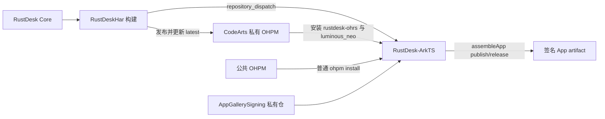

# RustDesk HAR → ArkTS GitHub Actions 链路

这套链路负责 HarmonyOS RustDesk Core HAR、完整 ArkTS 应用和签名 App 的构建与测试发布。



## ArkTS 构建流程

ArkTS workflow 接受 `rustdesk-har-published` dispatch，并保留要求填写精确来源的手动恢复入口。发布事件必须携带不可变包版本以及完整 Core/HAR SHA：

```json
{
  "package_name": "rustdesk-ohrs",
  "package_version": "1.4.9-r1234-567-1-g01234567",
  "core_sha": "0123456789abcdef0123456789abcdef01234567",
  "har_sha": "89abcdef0123456789abcdef0123456789abcdef"
}
```

构建步骤固定为：

1. Checkout ArkTS，安装 Java 17 与 HarmonyOS 命令行工具。
2. 发布事件从 CodeArts 私仓安装精确的 `rustdesk-ohrs@<version>`；普通 push 仅用于非 AGC 验证，可安装 `@latest`。同时安装固定版本 `luminous_neo@1.0.2`，并校验实际解包版本和 HAR integrity。
3. 删除私仓认证，再在根目录与 `entry` 执行普通 `ohpm install`。
4. Checkout 私有签名仓并调用 `.github/scripts/prepare-signing-config.sh` 准备签名配置。
5. 执行 App 级构建：

   ```shell
   hvigorw assembleApp -p product=publish -p buildMode=release
   ```

6. 找到并上传名为 `RustDesk-${完整 HAR 版本}.app` 的签名 artifact，同时附带 `release-provenance.json`，记录 ArkTS/Core/HAR SHA、签名仓精确 SHA、HAR 版本与 integrity、App 动态版本、App/HAP SHA-256 和 CI run 标识。

HAR workflow 的手动入口提供 `dispatch_downstream` 开关。滚动升级 HAR/ArkTS 接口时，可先以 `false` 发布同时兼容旧、新 ArkTS 的过渡 HAR，待 ArkTS `main` 更新并通过 push 构建后，再从 ArkTS 手动入口使用该精确包版本及完整 Core/HAR SHA 生成发布候选；常规自动链路保持 `true`。

## GitHub 配置

workflow 使用 `harmonyos-ci-signing` Environment。

| 类型 | 名称 | 用途 |
|---|---|---|
| Secret | `CODEARTS_PRIVATE_OHPM_READ` | CodeArts 私仓只读认证配置 |
| Secret | `SIGNING_REPOSITORY_TOKEN` | 读取签名私仓 |
| Variable | `SIGNING_REPOSITORY` | 可选，默认 `FrankHan052176/AppGallerySigning` |
| Variable | `SIGNING_REPOSITORY_REF` | 可选，默认固定到已验证的签名提交 |

`CODEARTS_PRIVATE_OHPM_READ` 保存私仓认证片段，例如：

```ini
//devrepo.devcloud.cn-north-4.huaweicloud.com/artgalaxy/api/ohpm/cn-north-4_c07b1b38744f424b8d87a86532d38003_ohpm_1/:_read_auth=REPLACE_WITH_READ_ONLY_TOKEN
strict_ssl=true
```

不要把真实 Token 或 `.ohpmrc` 提交到仓库。

## AGC 测试发布

配置 `AGC_CLIENT_ID`、`AGC_CLIENT_SECRET` 和 `AGC_APP_ID` 后，workflow 会调用 `.github/scripts/agc-test-release.sh` 上传并提交邀请测试版本；缺少任一 Secret 时跳过该步骤，仅保留签名 App artifact。测试固定使用 `testType=3` 与 `onshelfSelfDetect=0`，会收集所有测试群组；无群组时失败而不会提交空测试版本。可选变量 `AGC_TEST_DURATION_DAYS` 默认设置为 14 天。
