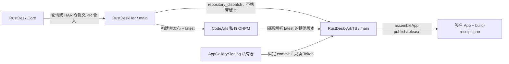

# RustDesk HAR → ArkTS GitHub Actions 链路

这套链路只负责 HarmonyOS 主控客户端的 Core HAR 与签名 App 构建，不包含 2in1 被控端、录屏或本地输入注入能力。



## 发布端固定流程

RustDeskHar 的唯一 workflow 同时覆盖四种触发：

- 每 10 分钟轮询 Core `master`；标准 `latest` 已包含同一 Core 8 位 SHA 时直接跳过。
- HAR `main` 的直接 commit 或 PR merge push：强制重新构建、发布并 dispatch。
- HAR pull request：只构建和上传 HAR artifact，不读取发布 Secret。
- 手动运行：强制重建，用于恢复发布或 dispatch。

版本与 EasyTier 使用同一格式：

```text
<Core版本>-<最近语义版本tag之后的提交数>-<Action序号>-<重试序号>-g<8位Core SHA>
```

OHPM 6.1.2.285 把 `latest` 作为预设标签，禁止显式 `--tag latest` 或 `@tag:latest`。因此发布端执行普通 `ohpm publish`，再轮询 `dist-tags list`，只有 `latest` 确实指向本次唯一版本时才 dispatch。若先行版本排序使 `latest` 没有移动，workflow 会明确失败，不会让 ArkTS 安装旧包。

旧的 self-hosted 与重复 Ubuntu HAR workflows 已删除，避免同一提交三重构建。

## 消费端固定流程

ArkTS workflow 只接受 `rustdesk-har-published` dispatch，也保留一个不带版本的手动恢复入口。dispatch payload 为：

```json
{
  "har_repository": "FrankHan052176/RustDeskHar",
  "core_repository": "FrankHan052176/rustdesk4ohos",
  "core_ref": "refs/heads/master",
  "package_name": "rustdesk-ohrs"
}
```

消费端不信任 payload 中的精确版本，也不使用无版本安装或 `@tag:latest`：

1. 在只有一个空 manifest 的临时 OHPM 工程中，用指定私仓执行 `ohpm dist-tags list rustdesk-ohrs`。
2. 从标准 `latest: <version>` 输出取得精确版本，并在日志打印 `Core HAR latest` 与 `Core HAR spec`。
3. 仅在该临时工程执行 `ohpm install rustdesk-ohrs@<version> --registry <CodeArts>`。
4. 校验包名、版本、OHPM integrity、原生动态库和 `BUILD_PROVENANCE.json`。
5. 把已安装包复制为 checkout 内的本地 `file:` 依赖，立即删除私仓配置和临时工程。
6. 不带 `--registry` 执行普通 `ohpm install --all`，安装 `@ohos/hypium`、Luminous Neo 等其余依赖。
7. 固定执行 App 级 `assembleApp product=publish buildMode=release`，校验并上传签名 `.app` 与构建回执。

这层隔离避免 `--registry` 把整个应用依赖图都发往 Core 私仓。OHPM 6.1.2.285 不能可靠地用 `@tag:latest` 安装；直接无版本安装还可能在带数字的先行版本之间按字典序选中旧包，因此必须先解析标签，再安装精确版本。

## HAR GitHub 配置

`FrankHan052176/RustDeskHar` 需要：

| 类型 | 名称 | 最小权限/值 |
|---|---|---|
| Secret | `CODEARTS_PRIVATE_OHPM` | 发布端完整 `.ohpmrc`，具备私仓读写权限 |
| Secret | `DOWNSTREAM_DISPATCH_TOKEN` | 只授予 `FrankHan052176/RustDesk-ArkTS` `Contents: Read and write` 的 fine-grained token |
| Variable | `CORE_REPOSITORY` | 可选，默认 `FrankHan052176/rustdesk4ohos` |
| Variable | `CORE_REF` | 可选，默认 `master` |
| Variable | `ARKTS_REPOSITORY` | 可选，默认 `FrankHan052176/RustDesk-ArkTS` |

## ArkTS GitHub 配置

workflow 使用 `harmonyos-ci-signing` Environment；Secret 可配置在仓库级，或配置在该 Environment 并限制到默认分支。

| 类型 | 名称 | 最小权限/值 |
|---|---|---|
| Secret | `CODEARTS_PRIVATE_OHPM_READ` | CodeArts 私仓只读认证配置 |
| Secret | `SIGNING_REPOSITORY_TOKEN` | 仅能读取签名私仓的 fine-grained token |
| Variable | `HAR_REPOSITORY` | 可选，默认 `FrankHan052176/RustDeskHar` |
| Variable | `CORE_REPOSITORY` | 可选，默认 `FrankHan052176/rustdesk4ohos` |
| Variable | `SIGNING_REPOSITORY` | 可选，默认 `FrankHan052176/AppGallerySigning` |
| Variable | `SIGNING_REPOSITORY_REF` | 可选；默认固定到已验证的 RustDesk 签名提交 `70779bd9e42c8565772dd8c43c80b89a197c3369` |
| Variable | `LUMINOUS_NEO_PACKAGE` | 可选，默认 `luminous_neo` |
| Variable | `LUMINOUS_NEO_VERSION` | 可选，默认 `1.0.0`；普通 OHPM registry 可访问的精确 SemVer |
| Variable | `ENABLE_AGC_SIGNED_APP_UPLOAD` | 保持未设置；真实 AGC 上传实现后才可设为 `true` |
| Variable | `ENABLE_AGC_TEST_RELEASE` | 保持未设置；真实 AGC 测试发布实现后才可设为 `true` |

`CODEARTS_PRIVATE_OHPM_READ` 保存完整认证片段，例如：

```ini
//devrepo.devcloud.cn-north-4.huaweicloud.com/artgalaxy/api/ohpm/cn-north-4_c07b1b38744f424b8d87a86532d38003_ohpm_1/:_read_auth=REPLACE_WITH_READ_ONLY_TOKEN
strict_ssl=true
```

工作流中的 Core registry 已固定为：

```text
https://devrepo.devcloud.cn-north-4.huaweicloud.com/artgalaxy/api/ohpm/cn-north-4_c07b1b38744f424b8d87a86532d38003_ohpm_1/
```

Secret 可以包含 `registry=`，但该配置只在隔离 Core 解析步骤中存在；进入普通依赖安装前一定会删除。不要把真实 Token 或 `.ohpmrc` 提交到仓库。

Luminous Neo 由普通 `ohpm install` 解析，不能依赖仅在 Core 隔离步骤中存在的 CodeArts registry。上传后应把可由普通 registry 访问的精确版本写入 `LUMINOUS_NEO_VERSION`。源码中的本地 HAR 路径仍保留给本机开发，CI 只在临时 checkout 中改写。

## 私有签名仓库

签名材料放在独立私有仓库中，RustDesk 使用自己的 debug/publish Profile：

```text
AppGallerySigning (private)
├── FrankHan.p12
├── FrankHan_Debug.cer
├── FrankHan_Publish.cer
└── RustDesk/
    ├── signingConfigs.json
    ├── RustDesk_DebugDebug.p7b
    └── RustDesk_PublishRelease.p7b
```

`.github/scripts/prepare-signing-config.sh` 只在 runner 临时目录生成绝对路径配置，`hvigorfile.ts` 在配置阶段注入 `default` 与 `publish` 签名。构建结束后会删除签名 checkout、临时配置、私仓认证和 vendored Core 包。

## AGC 占位

签名 App artifact 上传完成后有两个显式占位步骤：AGC App 上传、AGC 测试发布。当前没有任何 AGC 写入实现；如果误把对应变量设为 `true`，步骤会明确失败，避免把空占位误判为已上传或已发布。
